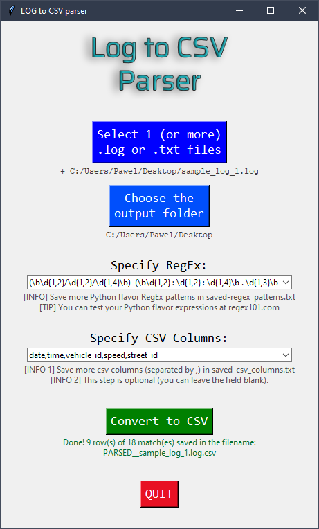
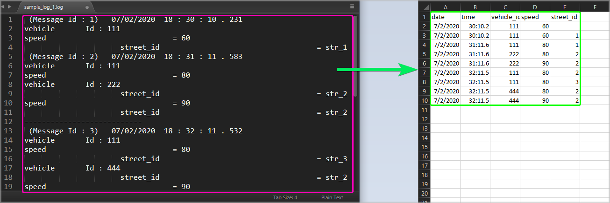
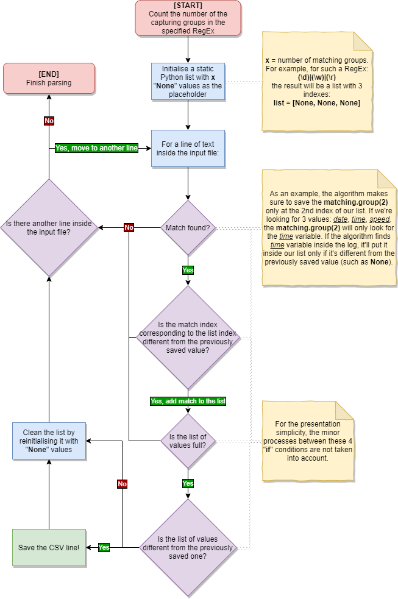

# Log to CSV Parser

The purpose of the Log to CSV Parser tool is to ease the analysis of the .log and .txt files. The tool parses the specified files with the defined RegEx string and outputs the results in a CSV format for a more comprehensive view.

<br />
<p align="center">
  

## Table of Contents

* [Example Input/Output File](#example-input/output-file)
* [Getting Started](#getting-started)
  * [Prerequisites](#prerequisites)
  * [Installation](#installation)
* [Usage](#usage)
* [Code Editing](#code-editing)
  * [General Parsing Algorithm](#general-parsing-algorithm)
  * [Specifying Own Parsing Algorithm](#specifying-own-parsing-algorithm)

## Example Input/Output File

Using the right RegEx string you can parse .log or .txt files (*left side of the image*) into an organised CSV file (*right side of the image*).

<br />
<p align="center">
  

## Getting Started
Make sure you have the right prerequisites to continue with the usage.

### Prerequisites

The main components of the script are [Standard Python Libraries](https://docs.python.org/3/library/), which should not require an individual installation if you have already installed [Python](https://www.python.org/downloads/) programming language. The used libraries are:
* [os](https://docs.python.org/3/library/os.html) – miscellaneous operating system interfaces.
* [sys](https://docs.python.org/3/library/sys.html) – system-specific parameters and functions.
* [csv](https://docs.python.org/3/library/csv.html) – CSV File Reading and Writing.
* [re](https://docs.python.org/3/library/re.html) – regular expression operations.
* [tkinter](https://docs.python.org/3/library/tkinter.html) – Python interface to Tcl/Tk. Used for the creation of the GUI.

### Installation

1. Download or clone this repo:
```sh
git clone https://github.com/pyxelr/Log_to_CSV_Parser.git
```

## Usage

1. Compile the `log_parser.py` file.
2. In the revealed GUI, you are advised to follow the presented options from top to bottom:
   * **Select 1 (or more) .log or .txt files** – after selecting the files, their paths will appear under the button.
     * you can also specify different file types (than .log or .txt) in the selection window that appears.
     * if you select more than one file, the parsing function will append the results from all the files in a single CSV file.
   * **Choose the output folder** – by default, the application uses the location of the script.
   * **Specify RegEx** – in this combo box you can either type own Python flavour RegEx or select the predefined ones using the drop-down menu.
     * you can save own RegEx inside the `saved-regex_patterns.txt` file.
     * you can test your RegEx using the [regex101.com](https://regex101.com/) website (don't forget to choose the Python flavour).
     * make sure to use RegEx groups by writing your strings between the brackets `( )` and separating different groups with the pipe `|` (or operator).
   * **Specify CSV columns** – optional step to write the requested columns in the first line of your CSV.
     * you can save own CSV columns inside the the `saved-csv_columns.txt` file.
     * make sure to use comma `,` between the different variables.
   * **Convert to CSV** – once you are ready, hit this button and wait for the parsing to be completed.
     * after successful conversion, a green message will appear below the button.
   * **QUIT** – close the application.
3. (optional) You can test the script by running the predefined RegEx on one of the files inside the `sample_logs` folder.

## Code Editing

The `log_parser.py` script aims to be well documented with different comments and clear variable names. You should be able to understand the working idea pretty quickly without extensive knowledge of the Python programming language.

### General Parsing Algorithm

The `GENERAL PARSER` algorithm works in a way specified on the flowgraph below. The workflow below has been simplified to capture the most necessary information. Please have a look inside the code to understand its full algorithm.

<br />
<p align="center">
  

### Specifying Own Parsing Algorithm

If you wish to specify your algorithm deciding when to save data inside the CSV file, you can modify the `parser()` function inside the `log_parser.py` file:
1. Find the line of code that contains:
```python
HERE YOU CAN ENTER YOUR INDIVIDUAL PARSING ALGORITHM
``` 
and enter your algorithm below it.
   * you can base your algorithm on the block of code above:
   ```python
   CUSTOM PARSER FOR A SPECIFIC REGEX STRING
   ```
2. For the ease of use, don't forget to enter your RegEx inside the `saved-regex_patterns.txt` file.
3. Save all the files and compile `log_parser.py` file.